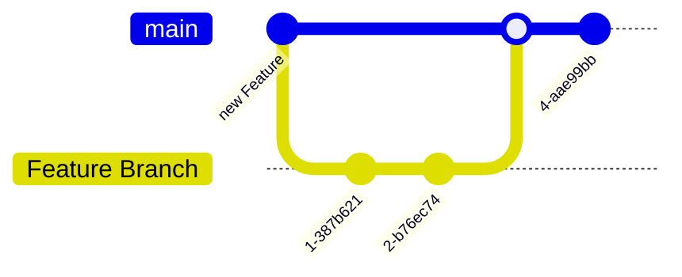

## GitHub Actions
You can integrate GitHub Actions into your repository by adding a `.github\workflows` folder in the root of your repository. In this folder, you can store all your GitHub Workflows.

Your GitHub Workflows can be triggered by a variety triggers. For example, if you want to trigger a GitHub workflow upon a commit, you can specify it like this:


on:
  push:


After specifying the trigger, you can add Actions to it. GitHub has a [Marketplace](https://github.com/marketplace?type=actions) where you can find lots of actions, or you can write your own action, in for example, [nodejs](https://pascalwilbrink.github.io/tags/nodejs).
You can add secrets for your GitHub Actions under `Repository > Settings > Secrets and variables > Actions`.

 

## Special Repositories

### .GitHub
GitHub has a lot of special repositories. One of these special repositories is the `.github` repository. The `.github` repository serves as a fallback if one of your other repositories does not contain a `.github` folder. For example, you can add an issue template in the `.github` repository that will be applied to all your repositories.

#### Organization level
If you have a `.github` repository in an organization, it can also serve as a profile page. The `README.md` inside this repository will be served on your organization.

## Profile
You can add a `username/username` GitHub repository where you can add a `README.md` file that will serve as your profile page.

## GitHub.io
You can use GitHub Pages to host static files. For example, if you have documentation that you want to give to your endusers, you can use gitHub.io.
This site is built with [Hugo](https://gohugo.io/) and published with a GitHub Action to GitHub.io.

## GitHub Apps
Next to GitHub Actions, you can make use of GitHub Apps. You can find a list of GitHub Apps in the [Marketplace](https://github.com/marketplace?type=apps). GitHub Apps can automatically deny pull requests or add extra checks for your code. For example, you can use `dependabot` as a GitHub app to automatically create new pull requests whenever your dependencies have new versions.

## CI/CD In Action
Let's say you have a Feature Branch Workflow like this:

Commiting directly on `main` has been disabled (Branch Protection Rule).

When merging the Feature Branch back to Main, it's possible to automatically create a new Release and publish it to, for example, npmjs.org



The GitHub Workflow above will be triggered when something has been pushed to `main`. It uses [Conventional Commits](https://www.conventionalcommits.org/) to generate a `CHANGELOG.md` and checks what the new version number should be. 

`git commit -m "Chore: Added new Feature [X]"`


| Prefix             | Version upgrade |
| ------------------ | --------------- |
| Feat:              | Minor           |
| Feat!:             | Major           |
| Fix:               | Patch           |
| [BREAKING CHANGE]: | Major           |


Other prefixes like `docs:`, `chore:`, `build:`, `ci:`, `test:` and `refactor:` may be used.

See [the Conventional Commits site](https://www.conventionalcommits.org/en/v1.0.0/#summary) for more info.

After the Feature branch has been merged back to `main`, The GitHub workflow will be triggered and it will create a new Pull Request with a generated `CHANGELOG.md` and an updated version number.

